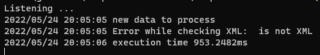

# Clipboard formatter
Dealing with unformatted **json** and **xml** is your daily basis? 
This program allows you to automatically format your data when you copy it, 
and it stores the formatted response in the same clipboard. So this
background process it's almost transparent for the end user. Behind the scenes
it launches two goroutines, one for dealing with json and another one for xml.

For the following input:
```json
{"order_num" : "O2012019231a", "order_date" : "2012-06-27", "order_id" : 21934, "order_item" : [{"product_id" : 20933, "quantity" : 3, "price" : 36000, "product_name" : "Thingamagic 2000", "unit_price" : 12000}, {"product_id" : 10366, "quantity" : 1, "price" : 100, "product_name" : "Super Duper Blooper", "unit_price" : 100}]}
```
You will get the formatted response in the clipboard and the following output
in the terminal:

```json
{
  "order_num" : "O2012019231a",
  "order_date" : "2012-06-27",
  "order_id" : 21934,
  "order_item" : [
    {
      "product_id" : 20933,
      "quantity" : 3,
      "price" : 36000,
      "product_name" : "Thingamagic 2000",
      "unit_price" : 12000
    },
    {
      "product_id" : 10366,
      "quantity" : 1,
      "price" : 100,
      "product_name" : "Super Duper Blooper",
      "unit_price" : 100
    }
  ]
}
```